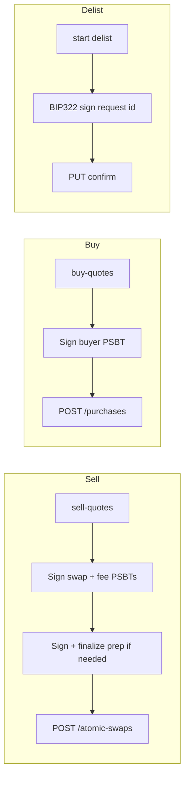

[](https://github.com/UnspendableLabs/Horizon-Market-Client/actions/workflows/ci.yml)
[](https://codecov.io/gh/UnspendableLabs/Horizon-Market-Client)
[](https://www.npmjs.com/package/@unspendablelabs/horizon-market-client)
[](https://opensource.org/licenses/MIT)


# @unspendablelabs/horizon-market-client

TypeScript client for the [Horizon Market](https://horizon.market) Atomic Swap API.

The API never receives your private key. Write operations use **signed PSBTs** (sell / buy / fee) or a **BIP322 message signature** (delist).

## Install

```bash
npm install @unspendablelabs/horizon-market-client
```

## Quote → sign → submit

Every write workflow follows the same pattern: the server composes unsigned PSBTs (or a delist message), you sign locally, then submit.



| Step | Sell | Buy | Delist |
|------|------|-----|--------|
| Quote | `POST sell-quotes` | `POST buy-quotes` | — |
| Sign | `prep_psbt` (finalize if present) + `swap_psbt` + `fee_psbt` | `psbt` (buyer inputs only) | BIP322 on delist `id` |
| Submit | `POST /atomic-swaps` | `POST /purchases` | `PUT delist-requests/{id}` |

Use the high-level workflow methods (`openSellOrder`, `fillSwaps`, `delistSwap`) or the REST helpers for manual control.

For manual sell flows, `signAndFinalizeSellPrep(quote, signer, network)` signs and finalizes attach or zeld transfer prep PSBTs from a sell quote.

## Quick Start

```ts
import { HorizonMarketClient } from "@unspendablelabs/horizon-market-client";

const client = new HorizonMarketClient({
  privateKey: "your-private-key-hex",
  network: "mainnet",
});

// --- Open a sell order (xcp, existing UTXO) ---
const { swap, created } = await client.openSellOrder({
  assetUtxoId: "abc123...64hex...:0",
  assetName: "RAREPEPE",
  assetQuantity: 1n,
  priceSats: 250_000,
  listingType: "xcp",
});

// --- Open a sell order (xcp, attach prep — no upfront UTXO needed) ---
const { swap: attachSwap } = await client.openSellOrder({
  assetName: "RAREPEPE",
  assetQuantity: 1n,
  priceSats: 250_000,
  listingType: "xcp",
});

// --- Open a sell order (ZELD transfer prep — mainnet only) ---
const { swap: zeldSwap, created: zeldCreated } = await client.openSellOrder({
  listingType: "zeld",
  assetName: "ZELD",
  assetQuantity: 100_000_000n,
  priceSats: 250_000,
  // No assetUtxoId — server composes prep_psbt; SDK finalizes → zeld_payment
});

// --- Buy ---
const sales = await client.fillSwaps({
  swapIds: ["swap_abc", "swap_def"],
  buyerAddress: "bc1q...",
  satsPerVbyte: 5,
  detach: true,
});

// --- Delist ---
await client.delistSwap("swap_abc");
```

## Locked asset UTXOs

Before listing, check which `asset_utxo_id` values are already locked in active listings for your seller address(es). This avoids double-listing or picking UTXOs that collide with fee inputs.

```ts
const locked = await client.getLockedAssetUtxoIds({
  sellerAddress: "bc1q...",
});
// { "txid64hex...:0": true, "another...:1": true }

if (locked["my-txid:0"]) {
  // UTXO is already in an open listing — pick another or delist first
}
```

`GET /api/atomic-swaps/asset-utxo-id` reports locks only; it does not discover wallet UTXOs.

## API

### Constructor

```ts
new HorizonMarketClient({
  privateKey?: string | Uint8Array,  // hex, with or without 0x
  signer?: Signer,                   // custom signer (hardware wallet, etc.)
  network?: "mainnet" | "testnet",   // default: "mainnet"
  baseUrl?: string,                  // default: "https://horizon.market"
  fetch?: typeof globalThis.fetch,   // injectable fetch (for tests / custom runtimes)
})
```

### Workflow Methods

- `openSellOrder(params)` — quote → sign → submit sell listing
- `fillSwaps(params)` — quote → sign → submit purchase
- `delistSwap(swapId)` — start → sign (BIP322) → confirm delist

### REST Helpers

All REST helpers accept an optional second argument `{ signal?: AbortSignal }` for request cancellation.

- `listSwaps(params?, options?)`
- `getSwap(id, options?)`
- `getLockedAssetUtxoIds(params?, options?)`
- `searchAssetNames(params?, options?)`
- `getPendingPurchaseTxIds(swapId, address, options?)`
- `requestSellQuote(params, options?)`
- `requestBuyQuote(params, options?)`
- `requestFeeQuote(params, options?)`
- `createSwap(req, options?)`
- `purchaseSwaps(params, options?)`
- `startDelist(swapId, options?)`
- `confirmDelist(requestId, signature, options?)`

Example:

```ts
const controller = new AbortController();
const swaps = await client.listSwaps({ limit: 10 }, { signal: controller.signal });
```

## Notes

- **Private key security**: never share your private key; this SDK signs locally.
- **`price`** is the **net sats the seller receives**. Buyers pay `price + royalty`.
- **Quote expiry**: `fee_payment_id` expires in 30 minutes — sign and submit promptly.
- **ZELD listings**: mainnet only. Sell from an existing UTXO (`fee_payment`), or omit `assetUtxoId` for **transfer prep** (finalize `prep_psbt` → `zeld_payment` on create).
- **ZELD idempotency**: transfer-prep creates (`zeld_payment`) may return HTTP 200 with `created: false` on replay, or 409 on conflict. Do not blindly retry xcp/ordinal creates.
- **Buyer address**: must be P2WPKH (`bc1q…` / `tb1q…`) for xcp/zeld.
- **Ordinal buys**: provide `buyerTaprootAddress` (receives the inscription) plus P2WPKH `buyerAddress` (funds the purchase).
- **Prep listings**: attach-prep and zeld transfer-prep swaps may be `funded: false` until the prep tx confirms — poll `getSwap` before `fillSwaps`.

## License

MIT
