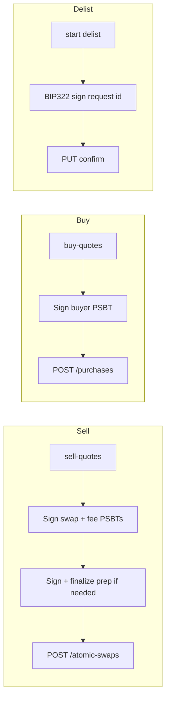

[](https://github.com/UnspendableLabs/Horizon-Market-Client/actions/workflows/ci.yml)
[](https://codecov.io/gh/UnspendableLabs/Horizon-Market-Client)
[](https://www.npmjs.com/package/@unspendablelabs/horizon-market-client)
[](https://opensource.org/licenses/MIT)


# @unspendablelabs/horizon-market-client

TypeScript client for the [Horizon Market](https://horizon.market) Atomic Swap API.

The API never receives your private key. Write operations use **signed PSBTs** (sell / buy / fee) or a **BIP322 message signature** (delist).

## Install

```bash
npm install @unspendablelabs/horizon-market-client
```

For the optional React UI (web or React Native), also install peer dependencies:

```bash
npm install react
# React Native apps only:
npm install react-native
```

## Quote → sign → submit

Every write workflow follows the same pattern: the server composes unsigned PSBTs (or a delist message), you sign locally, then submit.



| Step | Sell | Buy | Delist |
|------|------|-----|--------|
| Quote | `POST sell-quotes` | `POST buy-quotes` | — |
| Sign | `prep_psbt` (finalize if present) + `swap_psbt` + `fee_psbt` | `psbt` (buyer inputs only) | BIP322 on delist `id` |
| Submit | `POST /atomic-swaps` | `POST /purchases` | `PUT delist-requests/{id}` |

Use the high-level workflow methods (`openSellOrder`, `fillSwaps`, `delistSwap`) or the REST helpers for manual control.

For manual sell flows, `signAndFinalizeSellPrep(quote, signer, network)` signs and finalizes attach or zeld transfer prep PSBTs from a sell quote.

## Progress callbacks

Pass an optional second argument to `openSellOrder`, `fillSwaps`, or `delistSwap` to receive step-by-step progress events (useful for progress bars and status text):

```ts
await client.openSellOrder(params, {
  onProgress: ({ stepIndex, totalSteps, message, phase, step }) => {
    if (phase === "start" && totalSteps != null) {
      setProgress(stepIndex / totalSteps);
    }
    setStatus(message);
    console.log(step, phase, message);
  },
});
```

Each step emits `phase: "start"` before work begins and `phase: "complete"` when done. On failure, `phase: "error"` is emitted for the failing step before the error is re-thrown.

| Workflow | Steps |
|----------|-------|
| `openSellOrder` | `validateParams` → `requestSellQuote` → `signPrepPsbt`* → `finalizePrepPsbt`* → `signSwapPsbt` → `signFeePsbt`* → `createSwap` |
| `fillSwaps` | `validateParams` → `requestBuyQuote` → `signBuyerPsbt` → `submitPurchase` |
| `delistSwap` | `startDelist` → `signDelistMessage` → `confirmDelist` |

\* omitted when not applicable (no prep PSBT / no fee PSBT). `totalSteps` is `null` on the first `openSellOrder` events until the sell quote is received and the step plan is known.

## React UI (optional)

Import from `@unspendablelabs/horizon-market-client/react`. Bundlers pick the web or React Native build automatically (`react-native` condition on the `./react` export).

```tsx
import {
  HorizonMarketProvider,
  LoginPanel,
  SellOrderForm,
  SwapConfirmation,
  SwapList,
} from "@unspendablelabs/horizon-market-client/react";

function App() {
  return (
    <HorizonMarketProvider
      network="mainnet"
      ordApiBaseUrl="https://ord.example.com"
      theme={{ colors: { primary: "#3b82f6" } }}
    >
      <LoginPanel getPrivateKey={yourWeb3AuthGetPrivateKey} />
      <SwapList getPrivateKey={yourWeb3AuthGetPrivateKey} />
      <SellOrderForm onSuccess={(swap) => console.log(swap.id)} />
    </HorizonMarketProvider>
  );
}
```

| Export | Description |
|--------|-------------|
| `HorizonMarketProvider` | Context: client, addresses, `initialize` / `logout`, theme |
| `useHorizonMarket`, `useTheme` | Access provider state and resolved theme |
| `useLoginPanel`, `useAssets`, `useSellOrder`, `useSwapConfirmation`, `useSwapList` | Headless hooks (build your own UI) |
| `LoginPanel` | Email + Web3Auth-style `getPrivateKey` flow |
| `SwapList` | Browse, filter, buy, and delist swaps (orchestrates login + confirmation modals) |
| `SellOrderForm` | Multi-step sell listing (asset search, confirm, progress) |
| `SwapConfirmation` | Buy or delist a swap with progress UI |
| `WorkflowProgress` | Standalone progress list (also used inside the forms) |

On **web**, the provider injects theme CSS variables (`--hm-*`) and falls back to shadcn/ui tokens when present. On **React Native**, pass `styles` overrides per component.

## Quick Start

```ts
import { HorizonMarketClient } from "@unspendablelabs/horizon-market-client";

const client = new HorizonMarketClient({
  privateKey: "your-private-key-hex",
  network: "mainnet",
});

// --- Open a sell order (counterparty, existing UTXO) ---
const { swap, created } = await client.openSellOrder({
  assetUtxoId: "abc123...64hex...:0",
  assetName: "RAREPEPE",
  assetQuantity: 1n,
  priceSats: 250_000,
  listingType: "counterparty",
});

// --- Open a sell order (counterparty, attach prep — no upfront UTXO needed) ---
const { swap: attachSwap } = await client.openSellOrder({
  assetName: "RAREPEPE",
  assetQuantity: 1n,
  priceSats: 250_000,
  listingType: "counterparty",
});

// --- Open a sell order (ZELD transfer prep — mainnet only) ---
const { swap: zeldSwap, created: zeldCreated } = await client.openSellOrder({
  listingType: "zeld",
  assetName: "ZELD",
  assetQuantity: 100_000_000n,
  priceSats: 250_000,
  // No assetUtxoId — server composes prep_psbt; SDK finalizes → zeld_payment
});

// --- Buy ---
const sales = await client.fillSwaps({
  swapIds: ["swap_abc", "swap_def"],
  buyerAddress: "bc1q...",
  satsPerVbyte: 5,
  detach: true,
});

// --- Delist ---
await client.delistSwap("swap_abc");
```

## Kontor (KOR token + NFT)

Kontor assets use the same `openSellOrder` / `fillSwaps` / `delistSwap` methods — just
pass `listingType: "kontor"`. Unlike the PSBT asset types (where the server composes an
unsigned PSBT and the client signs it), Kontor atomic swaps are composed, signed, and
broadcast entirely client-side by the embedded `@kontor/sdk`. **Your private key never
leaves the client** — only signed transactions, the offer blob, and public addresses are
ever sent to the API.

Kontor is **signet-only** today, so construct the client with `network: "testnet"`
(signet shares testnet address params) and `kontorNetwork: "signet"`:

```ts
const client = new HorizonMarketClient({
  privateKey: "your-private-key-hex",
  network: "testnet",
  kontorNetwork: "signet",
});

// --- Sell KOR (fungible token) ---
const { swap } = await client.openSellOrder({
  listingType: "kontor",
  kontorAssetKind: "token",
  korAmount: "100.5",        // decimal string
  priceSats: 50_000,
});

// --- Sell a Kontor NFT ---
await client.openSellOrder({
  listingType: "kontor",
  kontorAssetKind: "nft",
  nftId: "my-nft-id",
  nftContractAddress: "nft@307992.5",
  priceSats: 250_000,
});

// --- Buy a Kontor swap (exactly one swapId) ---
await client.fillSwaps({ swapIds: ["swap_kontor_abc"] });

// --- Delist (revokes the on-chain offer, then BIP322-confirms) ---
await client.delistSwap("swap_kontor_abc");
```

**Funding UTXOs.** Kontor transactions are funded by your taproot UTXOs. By default the
client auto-fetches your confirmed taproot UTXOs from Horizon (only your public address is
sent). To supply them yourself — or use a dedicated funding address — pass `fundingUtxos`
on sell, `kontorFundingUtxos` on buy, or `fundingUtxos` in `delistSwap` options (a
`KontorUtxoInput[]` or a `() => Promise<KontorUtxoInput[]>` fetcher).

**Orphan protection.** The attach reveal is broadcast on-chain *before* the listing is
recorded. If the recording POST fails, `openSellOrder` throws
`KontorListingNotRecordedError` carrying `{ offerBlob, createRequest }` so you can retry the
POST without re-broadcasting (or revoke to reclaim the escrowed asset).

> Requires a `LocalSigner` (i.e. construct with `privateKey`). Custom signers must
> implement the optional `getKontorSigning(chain)` capability to support Kontor.

## Locked asset UTXOs

Before listing, check which `asset_utxo_id` values are already locked in active listings for your seller address(es). This avoids double-listing or picking UTXOs that collide with fee inputs.

```ts
const locked = await client.getLockedAssetUtxoIds({
  sellerAddress: "bc1q...",
});
// { "txid64hex...:0": true, "another...:1": true }

if (locked["my-txid:0"]) {
  // UTXO is already in an open listing — pick another or delist first
}
```

`GET /api/atomic-swaps/asset-utxo-id` reports locks only; it does not discover wallet UTXOs.

## API

### Constructor

```ts
new HorizonMarketClient({
  privateKey?: string | Uint8Array,  // hex, with or without 0x
  signer?: Signer,                   // custom signer (hardware wallet, etc.)
  network?: "mainnet" | "testnet",   // default: "mainnet"
  baseUrl?: string,                  // default: "https://horizon.market"
  fetch?: typeof globalThis.fetch,   // injectable fetch (for tests / custom runtimes)
  kontorNetwork?: "signet",          // enable Kontor ops (signet-only today; requires network: "testnet")
  kontorIndexerUrl?: string,         // default: public signet indexer; set for self-hosting / browser CORS
})
```

### Workflow Methods

- `openSellOrder(params)` — quote → sign → submit sell listing
- `fillSwaps(params)` — quote → sign → submit purchase
- `delistSwap(swapId)` — start → sign (BIP322) → confirm delist

### REST Helpers

All REST helpers accept an optional second argument `{ signal?: AbortSignal }` for request cancellation.

- `listSwaps(params?, options?)`
- `getSwap(id, options?)`
- `getLockedAssetUtxoIds(params?, options?)`
- `searchAssetNames(params?, options?)`
- `getPendingPurchaseTxIds(swapId, address, options?)`
- `requestSellQuote(params, options?)`
- `requestBuyQuote(params, options?)`
- `requestFeeQuote(params, options?)`
- `createSwap(req, options?)`
- `purchaseSwaps(params, options?)`
- `startDelist(swapId, options?)`
- `confirmDelist(requestId, signature, options?)`

Example:

```ts
const controller = new AbortController();
const swaps = await client.listSwaps({ limit: 10 }, { signal: controller.signal });
```

## Notes

- **Private key security**: never share your private key; this SDK signs locally.
- **`price`** is the **net sats the seller receives**. Buyers pay `price + royalty`.
- **Quote expiry**: `fee_payment_id` expires in 30 minutes — sign and submit promptly (null when `feeWaived`).
- **ZELD listings**: mainnet only. Sell from an existing UTXO (`fee_payment`), or omit `assetUtxoId` for **transfer prep** (finalize `prep_psbt` → `zeld_payment` on create, or `funding_tx_hex` when fee is waived).
- **ZELD idempotency**: transfer-prep creates (`zeld_payment`) may return HTTP 200 with `created: false` on replay, or 409 on conflict. Do not blindly retry counterparty/ordinal creates.
- **Buyer address**: must be P2WPKH (`bc1q…` / `tb1q…`) for counterparty/zeld.
- **Ordinal buys**: provide `buyerTaprootAddress` (receives the inscription) plus P2WPKH `buyerAddress` (funds the purchase).
- **Prep listings**: attach-prep and zeld transfer-prep swaps may be `funded: false` until the prep tx confirms — poll `getSwap` before `fillSwaps`.

## License

MIT
